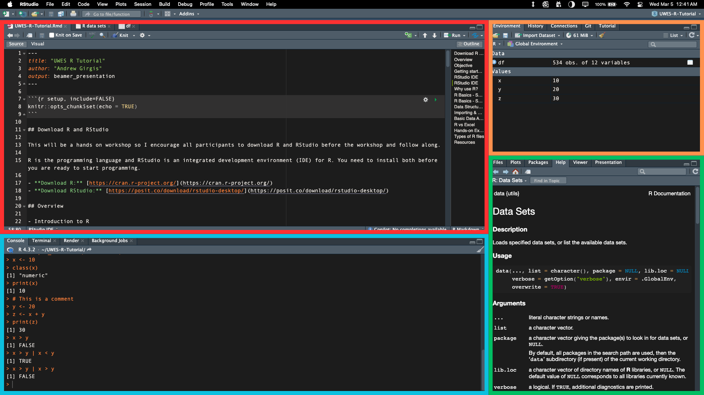

```{r setup, include=FALSE}
knitr::opts_chunk$set(echo = TRUE)
```

## Download R and RStudio

This will be a hands on workshop so I encourage all participants to download R and RStudio before the workshop and follow along.

R is the programming language and RStudio is an integrated development environment (IDE) for R. You need to install both before you are ready to start programming.

- **Download R:** [https://cran.r-project.org/](https://cran.r-project.org/)
- **Download RStudio:** [https://posit.co/download/rstudio-desktop/](https://posit.co/download/rstudio-desktop/)

## Overview

- Introduction to R
  - What is R?
  - Why use R?
  - R vs Excel
- Data structures in R
  - Vectors, Matrices, Data frames, Lists
- loading and viewing data
  - Loading built-in datasets
  - Reading CSV files
  - Subsetting data
- Basic data analysis in R
  - Summary statistics
  - Simple Visualization
  

## Objective + Classes

### Objective
- Understand the basics of R programming.
- Get familiar and comfortable with RStudio IDE.
- Learn how to load and visualize data in R.
- Prepare you for future courses and research projects

### Classes
- ECON 211: Introduction to Mathematical Economics
- ECON 221: Statistics for Economics
- ECON 322: Econometric Analysis 1
- ECON 323: Econometric Analysis 2 
- \+ Many more

## Getting started with R

R and RStudio are free and open source software environment for statistical computing and graphics. It compiles and runs on a wide variety of platforms, including Windows and MacOS. R has a large and active user community and is widely used in academia and industry. It has many built in tools for statistical data analysis and visualization.

## RStudio IDE

RStudio is an integrated development environment (IDE) for R. It includes a console, syntax-highlighting editor that supports direct code execution, as well as tools for plotting, history, debugging and workspace management.

Lets look at components of the RStudio IDE.

## RStudio IDE



## RStudio IDE

- \textcolor{red}{Source Editor:} For writing and executing R scripts.
- \textcolor{blue}{Console:} For executing R commands.
- \textcolor{orange}{Environment/History:} For viewing objects and history.
- \textcolor{ForestGreen}{Files/Plots/Packages/Help:} For managing files, plots, packages, and help.

## Why use R?

- R’s role in data science and economic research.
- Comparison with other tools like Excel, Python, and Stata.
- Real-world examples of economists and analysts using R.


## R Basics - Syntax & Data Types

- Variables and assignment 
```{r, echo=TRUE}
x <- 10
```
- Data types: Numeric, Character, Logical, Factor
```{r, echo=TRUE}
class(x)
```
- Printing values
```{r, echo=TRUE}
print(x)
```
- Comments in R 
```{r, echo=TRUE}
# This is a comment
```

## R Basics - Syntax & Data Types

- Arithmetic operations
```{r, echo=TRUE}
y <- 20
z <- x + y
print(z)
```

- Comparison operators
```{r, echo=TRUE}
x > y
```

- Logical operators
```{r, echo=TRUE}
x > y | x > y
```

## R Basics - Syntax & Data Types

\begin{table}[h]
\centering
\begin{tabular}{|l|l|l|}
\hline
\textbf{Data Type} & \textbf{Example} & \textbf{Description} \\ \hline
Numeric  & \texttt{x <- 10.5}  & Decimal numbers (double/float) \\ \hline
Integer  & \texttt{x <- 10L}   & Whole numbers \\ \hline
Character & \texttt{x <- "Hello"} & Text or string values \\ \hline
Logical  & \texttt{x <- TRUE} & Boolean values (\texttt{TRUE} or \texttt{FALSE}) \\ \hline
Factor   & \texttt{"Male", "Female"} & Categorical variables \\ \hline
Complex  & \texttt{x <- 3 + 2i} & Complex numbers \\ \hline
\end{tabular}
\caption{Data Types in R}
\label{tab:rdatatypes}
\end{table}


## Data Structures in R

- Vectors
```{r}
v <- c(1, 2, 3, 4, 5, 6)
```

- Matrices
```{r}
m <- matrix(v, nrow = 3)
```

- Data frames
```{r}
df <- data.frame(name=c("A", "B"), age=c(21, 25))
```

- Lists (list(name="John", age=30, salary=4000))
```{r}
l <- list(name="John", age=30, salary=4000)
```

## Indexing in R

- Indexing vectors (v[1])
```{r}
v[1]
```

- Indexing matrices (m[1, 2])
```{r}
m[1, 2]
```

## Indexing in R

- Indexing data frames (df[1, 2])
```{r}
df$age
```

- Indexing lists
```{r}
l$name
```


## Importing & Manipulating Data

- Loading built-in datasets (data(mtcars))
```{r}
data(mtcars)
```
- Reading CSV files (read.csv("data.csv"))
```{r, warning=FALSE, message=FALSE}
library(readr)
wage_df <- read_csv("wageData.csv")
```

## Importing & Manipulating Data

- Viewing data (head(df))
```{r}
head(wage_df)[1:2,]
```

- Subsetting data (df[1:10,])
```{r}
subset(wage_df[1:10,])
```

- Filtering with logical conditions (subset(df, age > 25))
```{r}
subset(wage_df, age > 25)
```

## Basic Data Analysis in R

- Summary statistics
```{r}
summary(mtcars$mpg)
```

- Calculating mean, median, standard deviation
```{r}
mean(mtcars$mpg)
median(mtcars$mpg)
sd(mtcars$mpg)
```

## Basic Data Analysis in R

- Calculating correlation
```{r}
cor(mtcars$mpg, mtcars$wt)
```

## Basic Data Analysis in R

- Simple plotting 
  - Histogram
```{r, out.width = "70%", fig.align='center'}
hist(mtcars$mpg,
     main="Histogram of MPG", 
     xlab="Miles per Gallon")

```

## Basic Data Analysis in R

- Simple plotting 
  - Scatterplot
```{r, out.width = "70%", fig.align='center', fig.cap="Scatterplot of MPG vs Weight"}
plot(mtcars$mpg, mtcars$wt,
     main="Scatterplot of MPG vs Weight", 
     xlab="Miles per Gallon", ylab="Weight")
```

## Customizing Plots

R has a wide variety of options for customizing plots. You can change the color, size, shape, and labels of the plot elements.

```{r, out.width = "70%", fig.align='center'}
plot(mtcars$mpg, mtcars$wt,
     main="Scatterplot of MPG vs Weight", 
     xlab="Miles per Gallon", ylab="Weight",
     col="red", pch=4, cex=1.5)
```

## Customizing Plots

```{r, out.width = "70%", fig.align='center'}
hist(mtcars$mpg,
     main="Histogram of MPG", 
     xlab="Miles per Gallon",
     density=20, angle=45,
     col="blue", border="black", breaks=10)

```


## R vs Excel

- Big data: R can handle large datasets that Excel can't.
- Open source + libraries: R has a large number of libraries for data analysis.
- Automation: R can automate repetitive tasks.
- Flexibility: R can handle complex data manipulation and analysis.
- Reproducibility: R scripts can be shared and reproduced.
- Visualization: R has better visualization capabilities.


## Types of R files

- R script (.R)
  - R Shiny
- R Markdown (.Rmd)
  - Presentations
  - Reports
  - Dashboards
  
## R Markdown

R Markdown is a file format that allows you to create dynamic documents with R code embedded in them. You can create presentations, reports, and dashboards using R Markdown.

Code chunks are enclosed in three backticks and the language name (e.g., {r}). The code is executed when the document is rendered.

Text can be formatted using Markdown/LaTeX syntax. The document can be rendered to HTML, PDF, or Word.


## Resources

- help function
```{r}
help(mean)
?mean
```

- R documentation
[https://www.rdocumentation.org/](https://www.rdocumentation.org/)

- RStudio cheat sheets
[https://www.rstudio.com/resources/cheatsheets/](https://www.rstudio.com/resources/cheatsheets/)

- R for Data Science
[https://r4ds.had.co.nz/](https://r4ds.had.co.nz/)

- R graphics customizations
[https://r-charts.com/base-r/#:~:text=CUSTOMIZATION,arguments%20of%20the%20par%20function.](https://r-charts.com/base-r/#:~:text=CUSTOMIZATION,arguments%20of%20the%20par%20function.)

## Hands-on Exercise

Activity:
- Load a dataset from R (Hint: use data() to find built-in datasets)
- Calculate summary statistics of a column in the data (mean, median, standard deviation).
  - Hint: use ?[name of dataset] to find the columns in the dataset.
- Plot a histogram with some customizations.
- Plot a scatterplot with some customizations.

## Thank you!

I hope you enjoyed the workshop. Please feel free to reach out to me if you have any questions or need help with R programming. 

- Email: a4girgis@uwaterloo.ca